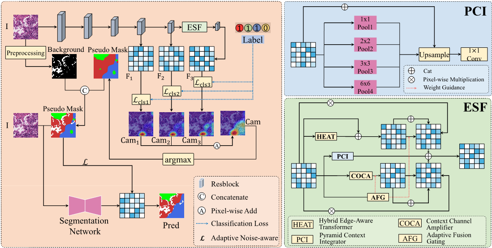

# Framework



# Usage

## Dataset

```python
ESFAN/

|_ datasets
|     |_ BCSS-WSSS/
|         |_ train/img/
|         |_ val/img/
|          |     |/mask/
|         |_ test/img/
|          |     |/mask/
|     |_ LUAD-HistoSeg/
|         |_ train/img/
|         |_ val/img/
|          |     |/mask/
|         |_ test/img/
|          |     |/mask/
```

## Pretrained weights , datasets and checkpoints

Download the pretained weight of classification stage via Google Cloud Drive ([Link)](https://drive.google.com/file/d/1Rka2SzqAwxUEFb28tbmiy2anhkkFOnTg/view?usp=drive_link)

Download the datasets via Google Cloud Drive ([Link)](https://drive.google.com/file/d/1lWAeCp6UN30VRVmqv97kA2sJ1Pp2frhC/view?usp=drive_link)([Link)](https://drive.google.com/file/d/178eSM9xs5jITt5P2kjaswDlJzwlU5gps/view?usp=drive_link)

Download the checkpoints of the first and second stages of LUAD-HistoSeg via Goole Cloud Drive ([Link)](https://drive.google.com/file/d/1_dSyEy1JrVEystyjqkoYf6YmWMrxmWNk/view?usp=drive_link)([Link)](https://drive.google.com/file/d/12oLS9aj8oEy1fN_xW8DQZMXkBm4qWsJy/view?usp=drive_link) 

Stage1 mIoU:76.42 Stage2 mIoU:79.55

Download the checkpoints of the first and second stages of WSSS-BCSS via Goole Cloud Drive ([Link)](https://drive.google.com/file/d/19CWs3rYqrJKMyZvxD90tejp-Ot2Nxogh/view?usp=drive_link)([Link)](https://drive.google.com/file/d/1ZDXJ9tlYKYnwlfyg88h_HKL0DWmi1sJD/view?usp=drive_link)

Stage1 mIoU:69.48 Stage2 mIoU:71.51

## Run each step:

1、Train the classification model and generate pesudo masks with the image-level label:

```python
python 1_train_stage1.py
```

2、Train the segmentation model with pesudo masks:

```python
python 2_train_stage2.py
```

3、Inference with the weights obtained from the segmentation stage：

```python
python inference.py
```

